# H2 Infra-as-code

Tämä on kotitehtäväraportti tehtävälle [1]
## x) Lue ja tiivistä

### Two Machine Virtual Network With Debian 11 Bullseye and Vagrant

Ohje näyttää lyhyesti miten Vagrant-ohjelmaa voi käyttää luodakseen kahden virtuaalikoneen verkon. Vagrant:in saa ladattua Linux:ille paketinhallinnan kautta, ja Windows:ille asennusohjelmalla. Kaksi virtuaalikonetta saa tehtyä käyttämällä Karvisen valmiiksi kirjoittamaa Vagrantfile-tiedostoa. Luotuja virtuaalikoneita saa käytettyä SSH-yhteyden avulla. Luodut virtuaalikoneet voi myös helposti tuhota komennolla ``vagrant destroy``, ja uudet virtuaalikoneet saa heti taas luotua komennolla ``vagrant up``.  [2]

### Salt Quickstart – Salt Stack Master and Slave on Ubuntu Linux

Salt:in käyttö aloitetaan asentamalla ``salt-master`` ohjauskoneeseen ja ``salt-minion`` ohjattaviin koneisiin. Seuraavaksi ``salt-minion``:ille määritetään nimi, sekä master:in osoite. Minion lähettää kryptografisen avaimen Master:ille, joka pitää hyväksyä. Lopuksi Minion:eille voi antaa tilakomentoja. [3]

### Hello Salt Infra-as-Code & top.sls

Ohje kertoo lyhyesti miten Salt-moduuli ja -tilatiedosto luodaan. Hakemistoon ``/srv/salt`` tehdään moduuli ``/hello``, jonka sisälle kirjoitetaan tilatiedosto ``init.sls``. Tilatiedostoon kirjoitetaan Salt:in idempotenttia koodia. Komennolla ``sudo salt-call --local state.apply hello`` moduulin ``hello`` tilatiedosto ajetaan paikallisesti. [4], [5]

Tiedostossa ``/srv/salt/top.sls`` määritetään, mitkä moduulit ajetaan ja mille Minion:ille. Tämän jälkeen tilat ajetaan yksinkertaisesti komennolla ``sudo salt '*' state.apply``. [5]

### Salt ja YAML

Salt:in tilatiedostot kirjoitetaan YAML-kielellä. Data muodostuu ``key:value``-pareista. Koodi on case-sensitive. Sarkainta ei saa käyttää, vaan sisennykset tehdään välilyönneillä. Arvot voivat olla numeroita, tekstiä tai boolean. Arvot voivat myös olla listoissa, joissa jokainen arvo sijoitetaan omalle riville ja sisennetään väliviivan kera. [6]

## a) Vagrant:in asennus

Asensin Vagrant:in Windows 11 tietokoneelleni asennustiedoston avulla [7]. Asennuksen jälkeen tietokone piti käynnistää uudelleen. VirtualBox oli jo ennestään asennettu. 

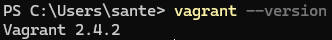

## b) Linux Vagrant

Loin ensimmäisen Linux-virtuaalikoneen Vagrant:illa seuraamalla [8].

Aloitin luomalla uuden projektikansion komennolla ``mkdir vagrant-project`` ja siirtymällä siihen. Projektikansiossa ajoin komennon ``vagrant init hashicorp/bionic64``, joka loi Vagrantfile-konfigurointitiedoston ja kertoo Vagrant:ia käyttämään virtuaalikoneissa ``hashicorp/bionic64`` virtuaalikoneboksia. Lopuksi käynnistin Vagrant:in komennolla ``vagrant up``, joka loi virtuaalikoneen.

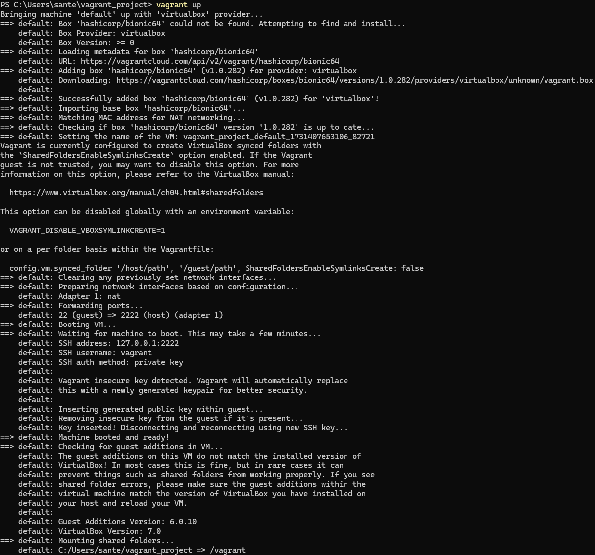

Testasin, että virtuaalikone toimii yhdistämällä siihen komennolla ``vagrant ssh``.

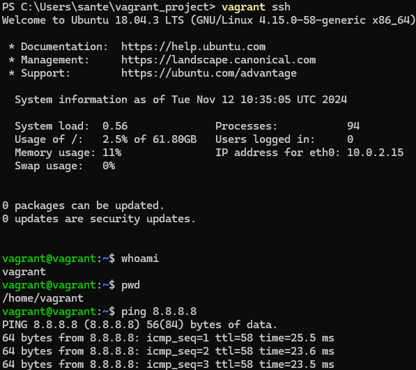

Tämän jälkeen kirjauduin virtuaalikoneesta ulos ja tuhosin sen komennolla ``vagrant destroy``.

## c) Kaksi konetta

Tätä kohtaa varten käytin Karvisen ohjetta [5] ja Vagrant:in dokumentaatiota [9].

Muokkasin Vagrantfile-tiedostoa niin, että se luo kaksi virtuaalikonetta kone001 ja kone002. Määritin niille myös oman yksityisen verkon, jotta ne saavat toisiinsa yhteyden.

```ruby
# -*- mode: ruby -*-
# vi: set ft=ruby :

Vagrant.configure("2") do |config|

  config.vm.box = "hashicorp/bionic64"

  config.vm.define "kone001" do |kone001|
    kone001.vm.network "private_network", ip: "192.168.12.11"
    kone001.vm.hostname = "kone001"
  end

  config.vm.define "kone002" do |kone002|
    kone002.vm.network "private_network", ip: "192.168.12.12"
    kone002.vm.hostname = "kone002"
  end

end
```

Käynnistäessäni koneet komennolla ``vagrant up``, törmäsin ensin ongelmaan, jossa Vagrant ei saanut luotua koneille omaa verkkoa. VirtualBox oli luonut läjän Ethernet Adapter:eita, jotka saattoivat aiheuttaa konfliktia. Poistin ne ja käynnistin Windows 11 koneeni uudelleen. Tällä kertaa ``vagrant up`` toimi ja loi halutut virtuaalikoneet.

Testasin, että koneet toimivat ja saivat toisiinsa yhteyden:

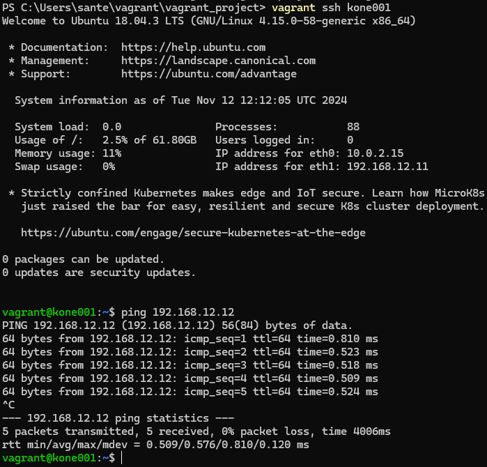

Myös kone002:sta yhteydet toimi:

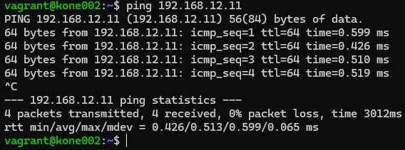

Lopuksi taas tuhosin koneet.

## d) Master-minion verkossa

Tässä osiossa luon Vagrant:illa kaksi virtuaalikonetta, joihin asennetaan Salt. Master on kone001 ja Minion on kone002. Käytän apuna Karvisen ohjetta [5] Vagrantfile-tiedoston kirjoittamiseen, sekä Salt:in asennusta varten Salt dokumentaatiota [10]. 

Aloitin muokkaamalla Vagrantfile-tiedostoa niin, että se asentaa kone001:lle ``salt-master``:in ja kone002:lle ``salt-minion``:in. Salt:in asentaminen on muuttunut, ja nykyään suositeltu tapa asentaa Salt on bootstrap-skriptin avulla:

	curl -o bootstrap-salt.sh -L https://github.com/saltstack/salt-bootstrap/releases/latest/download/bootstrap-salt.sh
	chmod +x bootstrap-salt.sh
	sudo ./bootstrap-salt.sh stable

Skripti ei ensin toiminut, mutta syyksi ilmeni se, että virtuaalikoneelle asennettu ``hashicorp/bionic64`` oli liian vanha Ubuntu 18.04. Vaihdoin tilalle uudemman ``ubuntu/jammy64``, joka on Ubuntu 22.04. Tämän jälkeen skripti toimi ja asensi Salt:in koneille.

Lopullinen Vagrantfile:

```ruby
# -*- mode: ruby -*-

# vi: set ft=ruby :

  

$master = <<MASTER

echo "Downloading Salt bootstrap script."

curl -o bootstrap-salt.sh -L https://github.com/saltstack/salt-bootstrap/releases/latest/download/bootstrap-salt.sh

echo "Making the script executable."

chmod +x bootstrap-salt.sh

echo "Launching bootstrap script to install salt-master."

sudo ./bootstrap-salt.sh -M stable

echo "Restarting salt-master."

sudo service salt-master restart

echo "Setup done."

MASTER

  

$minion = <<MINION

echo "Downloading Salt bootstrap script."

curl -o bootstrap-salt.sh -L https://github.com/saltstack/salt-bootstrap/releases/latest/download/bootstrap-salt.sh

echo "Making the script executable."

chmod +x bootstrap-salt.sh

echo "Launching bootstrap script to install salt-minion."

sudo ./bootstrap-salt.sh stable

echo "Setting the address of salt-master."

echo "master: 192.168.12.11">/etc/salt/minion

echo "Restarting salt-master."

sudo service salt-minion restart

echo "Setup done."

MINION

  

Vagrant.configure("2") do |config|

  

  config.vm.box = "ubuntu/jammy64"

  

  config.vm.define "kone001", primary: true do |kone001|

    kone001.vm.provision :shell, inline: $master

    kone001.vm.network "private_network", ip: "192.168.12.11"

    kone001.vm.hostname = "kone001"

  end

  

  config.vm.define "kone002" do |kone002|

    kone002.vm.provision :shell, inline: $minion

    kone002.vm.network "private_network", ip: "192.168.12.12"

    kone002.vm.hostname = "kone002"

  end

  

end
```

Koneiden käynnistyttyä otin yhteyden kone001 ja hyväksyin kone002:n lähettämän minion-avaimen, sekä testasin, että Minion:in komentaminen toimii.

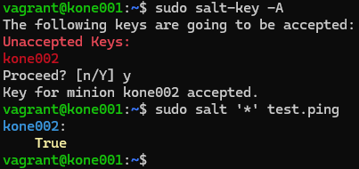

## e) Hei infrakoodi!

Ohjeena käytän [4].

Koneella kone001 tein uuden hakemiston Salt:in tilatiedostoille komennolla ``sudo mkdir -p /srv/salt/hello`` ja siirryin sinne. Sinne loin tilatiedoston komennolla ``sudoedit init.sls``. Tilatiedostoon kirjoitin:

```YAML
/tmp/hello-salt:
  file.managed
```

Kun tämä ajetaan paikallisesti komennolla ``sudo salt-call --local state.apply hello``, se luo tiedoston ``hello-salt``.

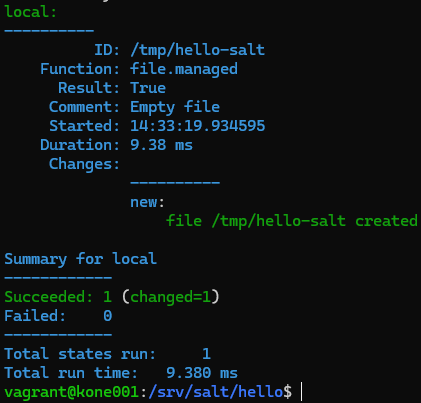

## f) "Hei infrakoodi!" Minion:ille

Ajoin saman tilatiedoston Minion:ille eli kone002:lle.

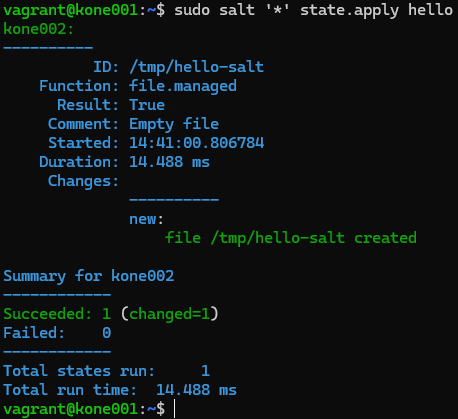

## g) Useampi tilafunktio

Loin uuden moduulin ``/srv/salt/sovelluksia``, jonka sisälle loin tilatiedoston ``init.sls``:

```YAML
vim:
  pkg.installed
sshd:
  service.running
/tmp/tiedosto:
  file.managed
nethack-console:
  pkg.installed
```

Tilatiedosto varmistaa, että ``vim`` on asennettu, ``sshd`` on päällä, ja että ``/tmp/tiedosto`` on olemassa. Ajoin sen paikallisesti komennolla ``sudo salt-call --local state.apply sovelluksia``. Tämän tuloksena tiedosto luotiin ja ``nethack-console`` asennettiin:

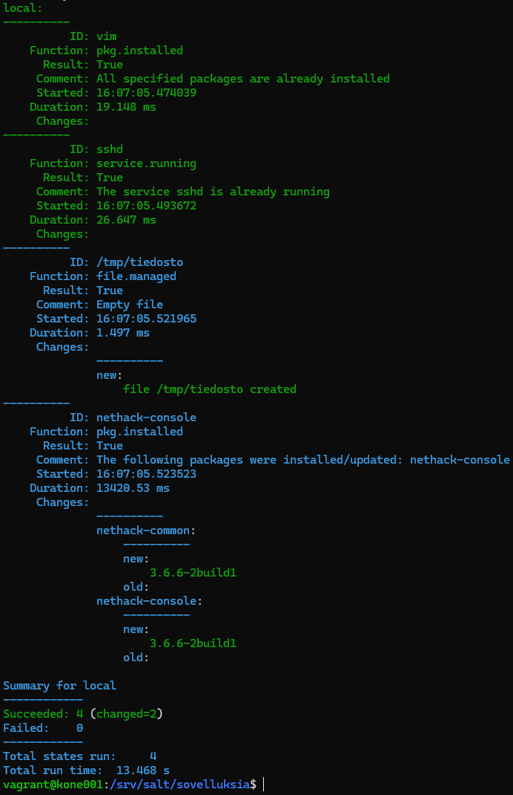

Tarkistin, että tiedosto todella luotiin ja ``nethack-console`` asennettiin:

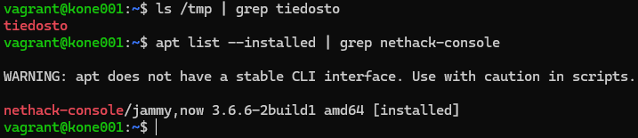

## h) top.sls

Ohjetta [5] avuksi käyttäen loin ``top.sls``-tiedoston hakemistoon ``/srv/salt``, joka ajaa moduulit ``hello`` ja ``sovelluksia``:

```YAML
base:
  '*':
    - hello
    - sovelluksia
```

Lopuksi ajoin kaikki luomani moduulit paikallisesti komennolla ``sudo salt-call --local state.apply``, joka lukee ``top.sls``-tiedoston ja ajaa tilatiedostot.

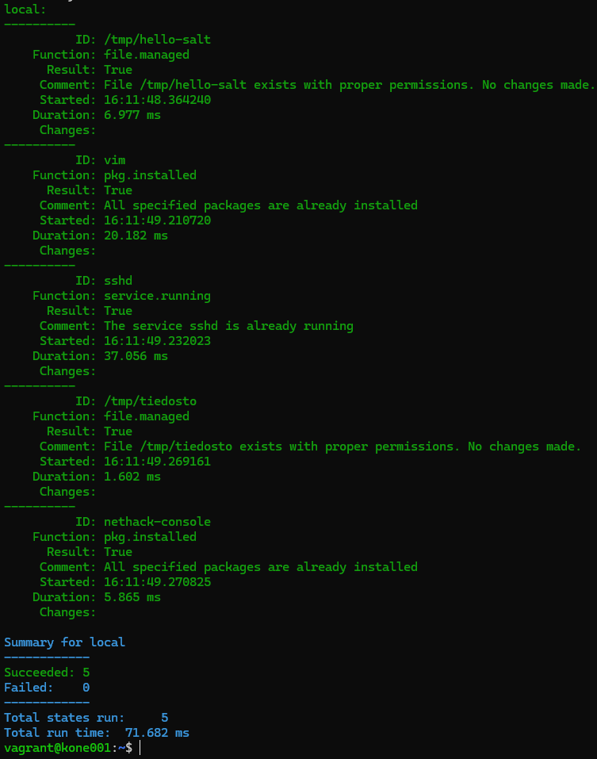

Huomaamme, että kaikki tilatiedostojen tilat olivat jo täyttyneet. Tämä osoittaa samalla miten Salt:in komennot ovat idempotentteja.

## Epäselvyyksiä ja kysymyksiä

Vaikka sain Salt:in tilatiedostot toimimaan ja tehtävien tavoitteet saavutettua, niin minulle on vielä vähän epäselvää miten monimutkaisempia tilatiedostoja kuuluu kirjoittaa. Esimerkiksi, jos haluan varmistaa, että ``nethack-console`` on asennettu, voin kirjoittaa esim. ``nethack.sls``-tilatiedoston - kuten Karvisen ohjeessa [5] - näin:

```YAML
nethack-console:
  pkg.installed
```

TAI - kuten tässä dokumentaatiossa [11] ohjeistetaan - näin:

```YAML
install_nethack:
  pkg.installed:
    - name: nethack-console
```

Molemmissa tapauksissa lopputulos on täsmälleen sama. Miten nämä eroavat toisistaan? Mikä on oikeaoppinen tapa kirjoittaa tilatiedostoja?

## Lähteet

[1]
T. Karvinen, “H2 Infra as Code - Palvelinten Hallinta - Configuration Management Systems Course - 2024 Autumn,” _Terokarvinen.com_, 2024. https://terokarvinen.com/palvelinten-hallinta/#h2-infra-as-code (accessed Nov. 11, 2024).

[2]
T. Karvinen, “Two Machine Virtual Network With Debian 11 Bullseye and Vagrant,” _Terokarvinen.com_, Nov. 04, 2021. https://terokarvinen.com/2021/two-machine-virtual-network-with-debian-11-bullseye-and-vagrant/ (accessed Nov. 11, 2024).

[3]
T. Karvinen, “Salt Quickstart - Salt Stack Master and Slave on Ubuntu Linux,” _Terokarvinen.com_, Mar. 28, 2018. https://terokarvinen.com/2018/03/28/salt-quickstart-salt-stack-master-and-slave-on-ubuntu-linux/ (accessed Nov. 11, 2024).

[4]
T. Karvinen, “Hello Salt Infra-as-Code,” _Terokarvinen.com_, Apr. 03, 2024. https://terokarvinen.com/2024/hello-salt-infra-as-code/ (accessed Nov. 11, 2024).

[5]
T. Karvinen, “Salt Vagrant - Automatically Provision One Master and Two Slaves,” _Terokarvinen.com_, 2014. https://terokarvinen.com/2023/salt-vagrant/#infra-as-code---your-wishes-as-a-text-file (accessed Mar. 28, 2023).

[6]
VMware Inc., “Salt Overview - Salt User Guide,” _Saltproject.io_, 2021. https://docs.saltproject.io/salt/user-guide/en/latest/topics/overview.html#rules-of-yaml (accessed Nov. 11, 2024).

[7]
HashiCorp, “Install | Vagrant | HashiCorp Developer,” _Install | Vagrant | HashiCorp Developer_, 2024. https://developer.hashicorp.com/vagrant/install (accessed Nov. 11, 2024).

[8]
HashiCorp, “Quick Start | Vagrant | HashiCorp Developer,” _Quick Start | Vagrant | HashiCorp Developer_, 2024. https://developer.hashicorp.com/vagrant/tutorials/getting-started (accessed Nov. 12, 2024).

[9]
HashiCorp, “Multi-Machine | Vagrant | HashiCorp Developer,” _Multi-Machine | Vagrant | HashiCorp Developer_, 2024. https://developer.hashicorp.com/vagrant/docs/multi-machine (accessed Nov. 12, 2024).

[10]
VMware Inc., “Bootstrap Installation - Salt Install Guide,” _Saltproject.io_, 2024. https://docs.saltproject.io/salt/install-guide/en/latest/topics/bootstrap.html (accessed Nov. 12, 2024).

[11]
VMware Inc., “Salt States - Salt User Guide,” _Saltproject.io_, 2021. https://docs.saltproject.io/salt/user-guide/en/latest/topics/states.html (accessed Nov. 12, 2024).

