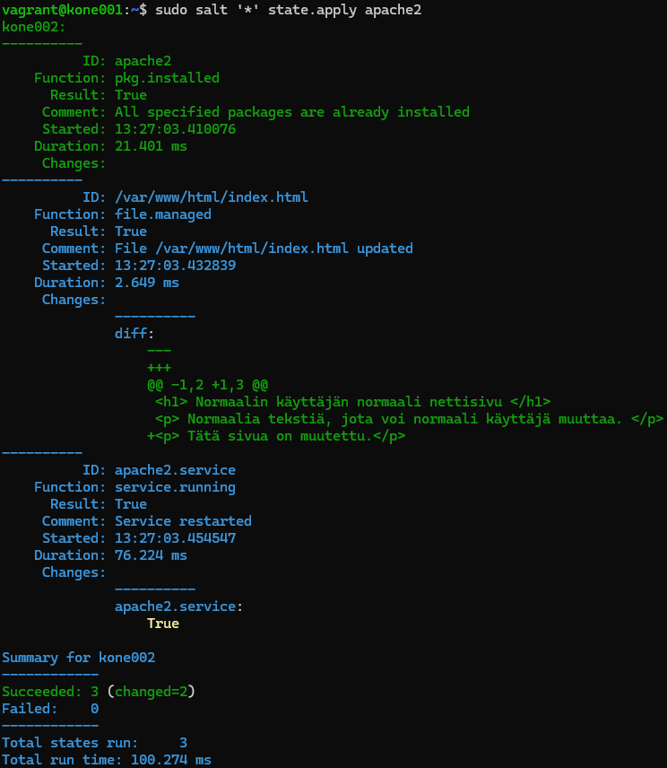

# H3 Demoni

Tehtäväraportti tehtävälle [H3 Demoni](https://terokarvinen.com/palvelinten-hallinta/#h3-demoni) [[1]](#lähdeluettelo).

## Sisällysluettelo

[x) Lue ja tiivistä](#x-lue-ja-tiivistä)

[a) Apache easy mode](#a-apache-easy-mode)

[b) SSHouto](#b-sshouto)

[c) Oma moduli](#c-oma-moduli)

[d) VirtualHost](#d-virtualhost)

## x) Lue ja tiivistä

### Pkg-File-Service – Control Daemons with Salt – Change SSH Server Port

Ohje [[2]](#lähdeluettelo) näyttää lyhyesti Salt-tilatiedoston ``sshd.sls``, joka asentaa minion:ille ``openssh-server``:in, luo sille konfiguraatiotiedoston ``sshd_config``, sekä huolehtii siitä, että SSH-demoni ``sshd`` on päällä. Tähän käytetään Salt:in tilafunktioita pkg, file ja service. Lisäksi ohje näyttää miltä ``sshd_config``:in sisällä on.

### Salt-dokumentaatio: pkg, file ja service

``pkg``-tilafunktiota käytetään asentamaan, päivittämään ja poistamaan paketteja. ``pkg.installed`` varmistaa, että määrätty paketti on asennettu. ``pkg.purged`` varmistaa, että paketti ja sen konfiguraatiotiedostot on poistettu. ``pkg.removed`` jättää konfiguraatiotiedostot rauhaan. Lisäämällä tilatiedostossa funktion alle parametrin ``pkgs`` voidaan määrittää useampi paketti, joita tilafunktio koskee. [[3]](#lähdeluettelo)

``file``-tilafunktiota käytetään manipuloimaan järjestelmän tiedostoja. ``file.managed`` on monikäyttöinen funktio, jolla manipuloidaan tiedostoa ja voidaan mm. varmistaa, että tietty tiedosto on minion:illa ja lataamaan se master:ilta, jos ei. Parametrilla ``content`` voidaan myös määrittää tiedoston sisältö. ``file.absent`` varmistaa, että tiedosto on poistettu. ``file.symlink``:illä varmistetaan, että tietyt symboliset linkit ovat olemassa. [[4]](#lähdeluettelo)

``service``-tilafunktiota käytetään käynnistämään, uudelleenkäynnistämään ja pysäyttämään järjestelmän demoneja, eli Linux:in järjestelmäpalveluja. ``service.running`` varmistaa, että demoni on päällä. Parametrilla ``watch`` voidaan määrittää, että demoni käynnistyy uudelleen, kun esim. konfiguraatiotiedostoa on muokattu. Parametrilla ``enable`` voidaan määrittää käynnistyykö demoni järjestelmän käynnistyessä. ``service.dead`` taas puolestaan varmistaa, että demoni on pois päältä. [[5]](#lähdeluettelo)

## a) Apache easy mode

Tämän kerran seikkailut alkoivat hauskalla yllärillä, kun ``vagrant up`` komennon seurauksena Windows 11 -koneeni heitti siniset veivit, viimeisinä sanoinaan: ``Stop code: DRIVER_IRQL_NOT_LESS_OR_EQUAL. What failed: VMMR0.r0``.


Veikkaukseni oli, että joko Vagrant tai VirtualBox on tähän syyllinen. Asensin ensin Vagrant:in uudelleen, mutta BSOD jatkui. Seuraavaksi latasin VirtualBox:in uusimman version ja asensin sen. Tämän jälkeen virtualisointi toimi kiltisti ja moitteetta. Myös "``VMMR0.r0``" viittaisi virtuaalikoneen olleen ongelma.

Käytän tässä tehtävässä kahta virtuaalikonetta, jotka loin Vagrant:illa hyödyntämällä H2-tehtävässä kirjoittamaani Vagrantfile-tiedostoa [[6]](https://github.com/edelmeister/configuration-management-course/blob/main/H2/H2-infra-as-code.md#d-master-minion-verkossa).

Ajoin kone001:llä komennon ``sudo salt-call --local state.single pkg.installed apache2``, joka asensi koneelle ``apache2``:n. Komennolla ``sudo salt-call --local state.single service.running apache2`` varmistin, että kyseinen demoni käynnistyi.


Tarkistin lisäksi, että Salt ei valehtele komennolla ``systemctl status apache2``. Apache2 näyttäisi siis toimivan.


Lisäksi testasin, että pystyn yhdistämään Apache2-palvelimelle menemällä host-koneeni selaimella osoitteeseen ``http://192.168.12.11``. Apache2:n oletussivu näkyi, joten yhteys toimi.

Seuraavaksi siirryin hakemistoon ``/var/www/html`` ja tein Apache2:n oletussivusta kopion. Sitten loin uuden ``index.html``-tiedoston, johon kirjoitin:

```HTML
<h1> MINUN VERKKOSIVU </h1>
<p> Tämä on Apache2-verkkosivupalvelin.</p>
```

Käynnistin palvelimen uudelleen komennolla ``sudo systemctl restart apache2``, virkistin selaimen ikkunan, ja ihailin uutta verkkosivuani.


Sitten koitti aika automoida kyseisen verkkosivupalvelimen luonti kone002:lle Salt:illa.

Kirjoitin uuden Salt moduulin ``apache2`` tilatiedoston ``/srv/salt/apache2/init.sls``, joka asentaa Apache2:n, varmistaa, että se on päällä, sekä kopioi master:ilta (kone001) HTML-tiedoston. Tähän apuna käytin Karvisen tilatiedostoa ohjeessa [[2]](#lähdeluettelo). Loin lisäksi moduulin kansioon symbolisen linkin ``index.html``, joka osoittaa master:in tiedostoon ``/var/www/html/index.html``.

```YAML
apache2:
  pkg.installed
/var/www/html/index.html:
  file.managed:
    - source: salt://apache2/index.html
apache2:
  service.running
```

Yritin suorittaa tilatiedostoa komennolla ``sudo salt '*' state.apply apache2``, mutta Salt sylki virheilmoituksen:


Tarkistin tiedoston kirjoitusvirheiltä ja pähkäilin asiaa tovin, mutten saanut sitä ratkaistua. Lopulta annoin ruutukaappauksen virhekoodista GPT-4o:lle ja kysyin mikä mahtaisi olla vikana. GPT-4o:n mukaan ongelma saattaa olla siinä, että ``init.sls``-tiedostossa on kaksi tilaa, joilla on sama ID, joka tässä tapauksessa on ``apache2:``. Muistin, että komennossa ``systemctl restart apache2`` ja ``...apache2.service`` ajavat samaa asiaa, joten nimesin tilatiedoston jälkimmäisen tilan ``apache2.service``.

```YAML
apache2:
  pkg.installed
/var/www/html/index.html:
  file.managed:
    - source: salt://apache2/index.html
apache2.service:
  service.running
```

Tämän jälkeen ajoin komennon ``sudo salt '*' state.apply apache2`` uudelleen, ja tällä kertaa komennot suorituivat onnistuneesti.


Lisäksi pystyin host-koneella selaamaan sivulle ``http://192.168.12.12`` (kone002:n IP-osoite), jossa näkyi tekemäni HTML-sivu.


## b) SSHouto

Tämän osan tavoite on luoda Salt-moduli, joka varmistaa, että minion:issa on SSHd asennettu ja päällä, ja se kuuntelee kahdessa eri portissa. Avuksi käytin ohjetta [[2]](#lähdeluettelo).

Loin ensin uuden hakemiston ``sshd`` master:in (kone001) Salt-hakemistoon, jonka sisälle tein uuden ``init.sls`` tiedoston. Tämä on muokattu Karvisen tilatiedoston [[2]](#lähdeluettelo) pohjalta.

```YAML
# /srv/salt/sshd/init.sls
openssh-server:
 pkg.installed
/etc/ssh/sshd_config:
 file.managed:
   - source: salt://sshd/sshd_config
sshd:
 service.running:
   - watch:
     - file: /etc/ssh/sshd_config
```

Sen jälkeen kopioin ``/etc/ssh/sshd_config``-tiedoston ``sshd``-modulin hakemistoon. Muokkasin sitä lisäämällä rivit:

    Port 22
    Port 1234

Lopulta ajoin ``sudo salt '*' state.apply sshd``, ja lopputulos onnistui.


Yritin yhdistää minion:iin master:ilta komennolla ``ssh -p 1234 vagrant@192.168.12.12``, mutta sain virheilmoituksen "Permission denied (public key)". Yritin sitten tehdä minion:ille uuden käyttäjän komennolla ``sudo salt '*' state.single user.present test-user``, joka teki uuden käyttäjän, mutta myös yhdistäminen komennolla ``ssh -p 1234 test-user@192.168.12.12`` myös epäonnistui samasta syystä. Tämä viittaisi siihen, että yhdistäminen vaatii avaimen. Tarkistin host-koneella Vagrant:in SSH-konfiguraatiot, josta selvisi, että Vagrant vaatii IdentityFile-tiedoston ``private-key`` SSH-yhteyteen. Kokeilin host koneelta SSH-yhteyttä niin, että kerron mistä tuo avain löytyy, eli komennolla ``ssh -i .\vagrant\machines\kone002\virtualbox\private_key -p 1234 vagrant@192.168.12.12``, ja tämä toimi, joten ainakin uuden portin lisääminen oli onnistunut. Yhdistäminen ``test-user``-käyttäjänä ei kuitenkaan onnistunut, koska avain on sille väärä.

Kysyn Karviselta seuraavalla luennolla, miten SSH-yhteydet kannattaa Vagrant:illa luotujen virtuaalikoneiden välillä määrittää.

Lopuksi testasin vielä kone001:llä komennolla ``nc -vz 192.168.12.12 1234``, että ``sshd_config``:in mukaiseen porttiin saa yhteyden.


## c) Oma moduli

Tässä osiossa kuvailen, millaisen oman modulin haluaisin myöhemmin kurssilla rakentaa.

Ideani on luoda Minecraft-pelipalvelinmoduli. Sen tavoite olisi automaattisest luoda kohde-minion:ille toimiva Minecraft-palvelin. Moduli asentaisi minion:ille ``minecraft-server``:in, loisi sille tarvittavat konfiguraatiot, sekä varmistaisi, että se pysyy päällä. Pelaajien edistyminen tallentuu palvelimen tietoihin, joten on myös tärkeää, että moduli suorittaa myös tarvittavat varmuuskopiot. Tämän lisäksi moduli voisi myös päivittää palvelinohjelman automaattisesti heti, kun sellainen on saatavilla, jotta pelaajien ``minecraft-client``, joka päivittyy automaattisesti, ei ole epäsuhdassa palvelimen version kanssa.

Moduli voisi toimia niin, että se lataa kaikki tarvittavat tiedostot master:ille, joka sitten jakelee ne minion:ille.

Odotan, että haasteita syntyy ainakin automaattisten varmuuskopioiden kanssa, koska emme ole kurssilla vielä käsitelleet liikennettä minion:ilta master:ille.

## d) VirtualHost

Tässä osiossa muokkaan [a) kohdan](#a-apache-easy-mode) tehtävää niin, että Apache tarjoilee HTML-tiedoston normaalin käyttäjän kotihakemistosta minion:in etusivulle. Sen täytyy myös olla muokattavissa normaalin käyttäjän oikeuksin.

Tein kone002:lle (minion:ille) uuden normaalin käyttäjän komennolla ``sudo adduser normaali``. Kirjauduin sille komennolla ``su - normaali`` ja tein käyttäjän kotihakemistoon tiedoston ``index.html``. Sitten kirjauduin ulos ja takaisin master:ille.

Muokkasin sitten tilatiedostoa ``/srv/salt/apache2/init.sls`` niin, että se hakee HTML-tiedoston käyttäjän ``normaali`` kotihakemistosta. Sitten ajoin tutun ``sudo salt '*' state.apply apache2``.


Testasin myös, että sivu näkyy kone002:n etusivulla.


Testasin, että ajamani komento on idempotentti ajamalla sen pari kertaa uudelleen. Tuloksena oli, että mikään ei muuttunut, joten idempotenttius oli saavutettu. Sitten kirjauduin taas kone002:lle normaali-käyttäjänä, ja muokkasin kotihakemistossa olevaa HTML-tiedostoa Nano:lla lisäämällä rivin:

    <p>Tätä sivua on muutettu.</p>

Sen jälkeen ajoin taas master:illa komennon ``sudo salt '*' state.apply apache2``.



Muutokset näkyvät myös selaimessa.


## Lähdeluettelo

[1]
T. Karvinen, “Palvelinten hallinta - configuration management systems course - 2024 autumn,” Terokarvinen.com, 2024. https://terokarvinen.com/palvelinten-hallinta/#h3-demoni (accessed Nov. 18, 2024).

[2]
T. Karvinen, “Pkg-File-Service – Control Daemons with Salt – Change SSH Server Port | Tero Karvinen,” Terokarvinen.com, 2018. https://terokarvinen.com/2018/04/03/pkg-file-service-control-daemons-with-salt-change-ssh-server-port/?fromSearch=karvinen%20salt%20ssh (accessed Nov. 18, 2024).

[3]
VMware Inc., “salt.states.pkg,” Saltproject.io, Oct. 23, 2023. https://docs.saltproject.io/en/latest/ref/states/all/salt.states.pkg.html (accessed Nov. 18, 2024).

[4]
VMware Inc., “salt.states.file,” Saltproject.io, Oct. 23, 2023. https://docs.saltproject.io/en/latest/ref/states/all/salt.states.file.html (accessed Nov. 18, 2024).

[5]
VMware Inc., “salt.states.service,” Saltproject.io, Oct. 23, 2023. https://docs.saltproject.io/en/latest/ref/states/all/salt.states.service.html (accessed Nov. 18, 2024).

[6]
S. Edelmann, “Kotitehtäväraportti H2 Infra-as-Code - d) Master-Minion verkossa,” GitHub, Nov. 12, 2024. https://github.com/edelmeister/configuration-management-course/blob/main/H2/H2-infra-as-code.md#d-master-minion-verkossa (accessed Nov. 18, 2024).