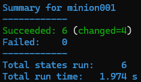

# H4 Puolikas

Tehtäväraportti tehtävälle [H4 Puolikas](https://terokarvinen.com/palvelinten-hallinta/#h4-puolikas) [[1]](#lähdeluettelo)

## Sisällysluettelo

- [1. Johdanto](#1-johdanto)
    - [1.1. Alusta](#11-alusta)
    - [1.2. Vaatimukset](#12-vaatimukset)
    - [1.3. Huomioita](#13-huomioita)
- [2. Virtuaalikoneiden luonti](#2-virtuaalikoneiden-luonti)
- [3. Minecraft-palvelimen asennus käsin](#3-minecraft-palvelimen-asennus-käsin)
    - [3.1. Järjestelmäkäyttäjänä](#31-järjestelmäkäyttäjänä)
- [4. Minecraft-Salt -moduuli](#4-minecraft-salt-moduuli)
    - [4.1. minecraft.service](#41-minecraftservice)
    - [4.2. Automatisointi](#42-automatisointi)


## 1. Johdanto

Tehtävän tavoite on aloittaa oma Salt-moduuli luomalla ensimmäinen vedos. Moduulin rakennusta jatketaan myöhemmin palautteen ja vinkkien pohjalta.

Oma tavoitteeni on luoda Minecraft-palvelinmoduuli, joka automatisoi Minecraft-pelipalvelimen pystyttämisen kohteena olevalle minion-koneelle.

### 1.1. Alusta

Host-koneena toimii Windows 11 -pöytätietokone. Prosessori on i7-9700K ja RAM:ia on 32 gigatavua.

Tehtävässä käytetään kahta virtuaalikonetta, jotka luon Vagrantin ja VirtualBoxin avulla. Alla on kirjoittamani ``Vagranfile`` [[2]](#lähdeluettelo), joka luo virtuaalikoneet. Vain IP-osoitteet ja koneiden nimet on muutettu alkuperäisestä tiedostosta. Master toimii Salt-masterina ja minion001 taas puolestaan minionina. Käyttöjärjestelmänä virtuaalikoneilla on Ubuntu Linux.

```ruby
# -*- mode: ruby -*-
# vi: set ft=ruby :

$master = <<MASTER
echo "Downloading Salt bootstrap script." 
curl -o bootstrap-salt.sh -L https://github.com/saltstack/salt-bootstrap/releases/latest/download/bootstrap-salt.sh
echo "Making the script executable."
chmod +x bootstrap-salt.sh
echo "Launching bootstrap script to install salt-master." 
sudo ./bootstrap-salt.sh -M stable
echo "Restarting salt-master."
sudo service salt-master restart
echo "Setup done."
MASTER

$minion = <<MINION
echo "Downloading Salt bootstrap script."
curl -o bootstrap-salt.sh -L https://github.com/saltstack/salt-bootstrap/releases/latest/download/bootstrap-salt.sh
echo "Making the script executable."
chmod +x bootstrap-salt.sh
echo "Launching bootstrap script to install salt-minion."
sudo ./bootstrap-salt.sh stable
echo "Setting the address of salt-master."
echo "master: 192.168.10.10">/etc/salt/minion
echo "Restarting salt-master."
sudo service salt-minion restart
echo "Setup done."
MINION

Vagrant.configure("2") do |config|

  config.vm.box = "ubuntu/jammy64"

  config.vm.define "master", primary: true do |master|
    master.vm.provision :shell, inline: $master
    master.vm.network "private_network", ip: "192.168.10.10"
    master.vm.hostname = "master"
  end

  config.vm.define "minion001" do |minion001|
    minion001.vm.provision :shell, inline: $minion
    minion001.vm.network "private_network", ip: "192.168.10.11"
    minion001.vm.hostname = "minion001"
  end

end
```

### 1.2. Vaatimukset

Tarvitaan Minecraft-client, joka minulla on jo asennettuna host-koneella, sekä Minecraft-server palvelinkoneella. Tässä tehtävässä käytän Minecraft Java Edition:ia. Lisäksi palvelinohjelma vaatii suoriutuakseen Java Runtime Environment:in (JRE). Käytän OpenJDK 21.

Vaatimukset ja ohjeet luen Minecraft Wikin tutoriaalista [[3]](#lähdeluettelo)

### 1.3. Huomioita

Tässä tehtävässä luon Minecraft-palvelimen, johon pääsee yhdistämään vain host-koneeltani. Teen tämän rajauksen tietoturvasyistä, jotta en vahingossa avaa suojaamattomia yhteyksiä ulkomaailmaan. Tuotannossa palvelinten verkossa täytyy suorittaa vaadittavat porttiohjaukset, jotta verkon ulkopuolelta pääsee pelipalvelimelle.

## 2. Virtuaalikoneiden luonti

Aloitan luomalla host-koneelle projektikansion ``minecraft-module``, jonka sisällä ajan komennon ``vagrant init``. Komento alustaa kansion luomalla sinne Vagrantfile-tiedoston. Korvaan tiedoston kohdassa [1.1.](#11-alusta) esitellyllä Vagrantfile-tiedostolla.

Käynnistän koneet komennolla ``vagrant up``. Vagrant luo koneet Vagrant-file:n määritysten mukaan ja asentaa niille Ubuntun version 22.04.5. Lisäksi skriptit tiedoston sisällä asentaa masterille ``salt-master``:in ja minionille ``salt-minion``:in ja kertoo minionille masterin osoitteen.

Vagrantin toimenpiteiden valmistuttua, yhdistin master-koneeseen komennolla ``vagrant ssh master`` varmistaakseni, että asennus onnistui. Tein saman myös minionille.


Lisäksi päivitin käsin molempien ohjelmistot uusimpiin komennoilla ``sudo apt update && sudo apt upgrade``. Päivitysten jälkeen käynnistin molemmat uudelleen.

Tarkistin myös masterilla, että Salt asentui oikein komennolla ``salt --version``. Sen jälkeen hyväksyin minionin avaimen komennolla ``sudo salt-key -A``. Testasin yhteyden minioniin komennolla ``sudo salt '*' test.ping``. Yhteydet toimivat.


## 3. Minecraft-palvelimen asennus käsin

Asennan Minecraft-palvelimen ensin käsin master-koneelle, jonka jälkeen prosessi vasta automatisoidaan.

Asensin ensin OpenJDK:n - joka sisältää JRE:n - komennolla ``sudo apt install openjdk-21-jdk-headless`` [[3]](#lähdeluettelo). Seuraavaksi teen uuden kansion kotihakemistoon ``mkdir minecraft``. Lataan sinne ``server.jar`` tiedoston, kuten Minecraftin virallisella lataussivulla [[4]](#lähdeluettelo) ohjeistetaan. Tein latauksen komennolla ``wget https://piston-data.mojang.com/v1/objects/45810d238246d90e811d896f87b14695b7fb6839/server.jar``. Siirryin minecraft-hakemistoon ja ajoin palvelinohjelman komennolla ``java -jar server.jar nogui``. Sen jälkeen hakemisto näytti tältä:


Enne kuin palvelin toimii, täytyy ``eula.txt`` tiedostosta muuttaa rivi ``eula=false`` -> ``eula=true``. Tämän jälkeen käynnistän palvelinohjelman taas uudestaan. Ohjelma luo Minecraft-maailman ja muut tarvittavat tiedostot. Palvelinohjelma pyörii portissa 25565.

Maailman luonti epäonnistui aluksi sen jumittuessa "``Preparing spawn area: 2%``". Ajoin ohjelman uudelleen, mutta maailman luonti epäonnistui tällä kertaa 16%:iin. Minecraft-serverille suositellaan annettavaksi vähintään yksi gigatavu muistia, mutta minun virtuaalikoneissa oli vain kokonaisuudessaan yksi gigatavu. Suljen koneet, nostan niiden muistit VirtualBoxissa kahteen gigatavuun ja käynnistän ne uudelleen. Tämän jälkeen Minecraft-palvelin käynnistyi onnistuneesti.

Käynnistin Minecraft Java Edition:in host-koneellani ja yhdistin osoitteeseen 192.168.10.10:25565. Palvelin otti minut vastaan ja pääsin peliin.


Palvelimen ollessa päällä, sen saa pysäytettyä komennolla ``/stop``.

Lopulta Minecraft-palvelimen hakemisto näyttää tältä:

¨

### 3.1. Järjestelmäkäyttäjänä

Minecraft Wiki suosittelee, että palvelinta ei ajeta super user:ina, joten teen edellisen vielä omalla järjestelmäkäyttäjällä.

Luon uuden järjestelmäkäyttäjän nimeltä Minecraft master-koneelle komennolla ``sudo adduser minecraft --system --group --shell /bin/bash``. Kirjaudun käyttäjälle komennolla ``sudo -i -u minecraft``. Lataan sen kotihakemistoon ``server.jar``-tiedoston kuten aikaisemmin, hyväksyn EULA:n ja käynnistän palvelimen. Testasin myös, että tämä toimi odotetusti.

## 4. Minecraft-Salt-moduuli

Aloitan luomalla master-koneelle Salt-moduulin kansion ``/srv/salt/minecraft-server``, jonne luon uuden Salt-tilatiedoston komennolla ``sudoedit init.sls``. Tilatiedoston täytyy asentaa minionille OpenJDK, tarjoilla sille Minecraft-palvelinohjelma, käynnistää se ja pitää sitä päällä. Jotta master voi tarjoilla minionille palvelinohjelman, sisällytän moduulin kansioon myös itse ``server.jar``-tiedoston ja valmiiksi hyväksytyn ``eula.txt``-tiedoston.

### 4.1. minecraft.service

Ongelmana on kuitenkin se, että Minecraft-palvelinohjelma ei ole Linux-demoni, jota voisi ohjata Saltin ``service.running``-tilafunktiolla. Googlailun jälkeen opin, että Linuxiin voi luoda demoneita systemd unit -tiedostoilla. Tutustun aiheeseen Linux Handbookin artikkelissa [[5]](#lähdeluettelo), sekä Minecraft Wikissä [[6]](#lähdeluettelo).

Loin uuden systemd unit -tiedoston ``sudoedit /etc/systemd/system/minecraft.service``. Tiedosto luo ``minecraft.service``-demonin, joka käynnistää käyttäjän minecraft kotihakemistossa sijaitseva palvelinohjelman. Se käynnistyy aina, kun kone itse käynnistyy.

```ini
[Unit]
Description=Minecraft Server
After=network.target

[Service]
User=minecraft
Group=minecraft
WorkingDirectory=/home/minecraft
ExecStart=/usr/bin/java -jar /home/minecraft/server.jar nogui
Restart=always
RestartSec=10
StandardOutput=syslog
StandardError=syslog
SyslogIdentifier=MinecraftServer

[Install]
WantedBy=multi-user.target
```

Tämän jälkeen käynnistin systemd-demonin uudelleen ``sudo systemctl daemon-reload`` ja enabloin ``minecraft.service``:n komennolla ``sudo systemctl enable minecraft``. Sen jälkeen sen sai käynnistettyä ``sudo systemctl start minecraft``. Varmistin, että demoni on päällä komennolla ``sudo systemctl status minecraft``.


Reaaliaikaista lokia demonin suoriutumisesta saa seurattua komennolla ``sudo journalctl -u minecraft -f``.

### 4.2. Automatisointi

Kirjoitin tilatiedoston, - Saltin dokumentaation avulla [[7][8]](#lähdeluettelo) - joka täyttää vaatimukseni. Se ensin asentaa OpenJDK:n, lisää järjestelmäkäyttäjän, tarjoilee palvelinohjelman, EULA:n, sekä demonin masterilta, ja lopuksi käynnistää demonin. Muutaman kirjoitusvirheen korjaamisen jälkeen ``init.sls`` näytti tältä:

```YAML
openjdk-21-jdk-headless:
  pkg.installed
minecraft:
  user.present:
    - system: True
    - shell: /bin/bash
    - home: /home/minecraft
    - groups:
      - minecraft
/home/minecraft/server.jar:
  file.managed:
    - source:
      - salt://minecraft-server/server.jar
/home/minecraft/eula.txt:
  file.managed:
    - source:
      - salt://minecraft-server/eula.txt
/etc/systemd/system/minecraft.service:
  file.managed:
    - source:
      - salt://minecraft-server/minecraft.service
minecraft.service:
  service.running
```

Ajoin moduulin paikallisesti komennolla ``sudo salt-call --local state.apply minecraft-server``.


Seuraavaksi ajoin sen minionille ``sudo salt '*' state.apply minecraft-server``, joka epäonnistui.


Tila epäonnistui, koska käytin ``user.present``:issä parametria ``group``, joka johtaa virheeseen, jos nimettyä ryhmää ei ole olemassa. Korvasin sen parametrilla ``usergroup: True``, joka luo käyttäjälle samannimisen ryhmän, jos sitä ei ole olemassa.

Tämän jälkeen tila onnistui!



Pääsin myös liittymään palvelimelle host-koneelta!


Testasin myös idempotenttiyden ajamalla komennon ``sudo salt '*' state.apply minecraft-server`` useaan kertaan lopputuloksen muuttumatta.

## 5. Seuraavat askeleet

Tämä on vasta moduulini ensimmäinen versio. 

Tällä hetkellä palvelimen ylläpitäjä ei pääse antamaan Minecraft-serverin sisäisiä komentoja, koska rajapintaa sille ei vielä ole. Yritän seuraavaksi lisätä tämän ominaisuuden moduuliin.

Tahdon integroida moduuliin myös automaattisen varmuuskopioinnin minionilta masterille, jotta pelaajien edistys tallentuu siinäkin tapauksessa, että palvelin kaatuu tai korruptoituu.

Lisäksi Minecraft-palvelimen ``server.properties``-tiedostossa on paljon asetuksia, joilla voi esim. muuttaa pelin vaikeustasoa yms.

Palvelin kaipaa myös whitelist-ominaisuuden käyttöönottoa, jotta ei-halutut pelaajat eivät pääse palvelimelle vaikka se avattaisiinkin julkisesti saavutettavaksi (esim. tuotannossa).

Tähän asti pääseminen oli kuitenkin jo suuri saavutus, ja olen lopputuloksesta hyvin tyytyväinen.

## Lähdeluettelo

[1]
T. Karvinen, “Palvelinten Hallinta - Configuration Management Systems Course - 2024 Autumn,” Terokarvinen.com, 2024. https://terokarvinen.com/palvelinten-hallinta/#h4-puolikas (accessed Nov. 26, 2024).

[2]
S. Edelmann, “H2 Infra-as-code - Kotitehtäväraportti,” GitHub, Nov. 12, 2024. https://github.com/edelmeister/configuration-management-course/blob/main/H2/H2-infra-as-code.md#d-master-minion-verkossa (accessed Nov. 26, 2024).

[3]
“Tutorials/Setting up a Server – Minecraft Wiki,” Minecraft Wiki, 2024. https://minecraft.wiki/w/Tutorials/Setting_up_a_server (accessed Nov. 26, 2024).

[4]
Mojang AB, “Minecraft Server Download,” Minecraft.net, 2024. https://www.minecraft.net/en-us/download/server (accessed Nov. 26, 2024).

[5]
P. Patel, “How to Create a Systemd Service in Linux,” Linux Handbook, Jan. 06, 2023. https://linuxhandbook.com/create-systemd-services/ (accessed Nov. 26, 2024).

[6]
“Tutorials/Server Startup Script,” Minecraft Wiki, 2010. https://minecraft.fandom.com/wiki/Tutorials/Server_startup_script#Systemd_Script (accessed Nov. 26, 2024).

[7]
VMware Inc., “salt.states.user,” Saltproject.io, Oct. 23, 2023. https://docs.saltproject.io/en/latest/ref/states/all/salt.states.user.html#module-salt.states.user (accessed Nov. 26, 2024).

[8]
VMware Inc., “salt.states.file,” Saltproject.io, Oct. 23, 2023. https://docs.saltproject.io/en/latest/ref/states/all/salt.states.file.html#salt.states.file.managed (accessed Nov. 26, 2024).