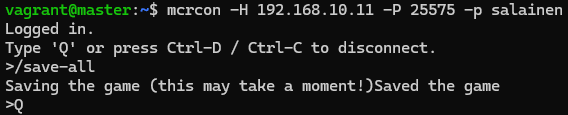
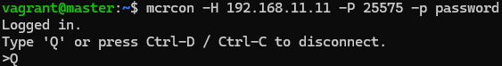

# Tehtävä

Tehtäväraportti tehtävälle [H5 Loppuhuipennus](https://terokarvinen.com/palvelinten-hallinta/#h5-loppuhuipennus) [[1]](#lähdeluettelo)

## Sisällysluettelo


- [1. Johdanto](#1-johdanto)
- [2. Oma miniprojekti (tehtävän kohta a)](#2-oma-miniprojekti-tehtävän-kohta-a)
  - [2.1. Remote console](#21-remote-console)
  - [2.2. minecraft.service](#22-minecraftservice)
  - [2.3. Salt-moduulin päivitys](#23-salt-moduulin-päivitys)
  - [2.4. Puhdas minioni](#24-puhdas-minion)
  - [2.5. Moduuli on valmis](#25-moduuli-on-valmis)
- [3. Moduulin etusivu (tehtävän kohta b)](#3-moduulin-etusivu-tehtävän-kohta-b)
  - [3.1. Repositorion luominen](#31-repositorion-luominen)
  - [3.2. Repositorion testaus](#32-repositorion-testaus)
  - [3.3. READMEn kirjoitus](#33-readmen-kirjoitus)
- [Lähdeluettelo](#lähdeluettelo)


## 1. Johdanto

Tämä raporttia on suoraan jatkoa edelliselle [H4 Puolikas](https://github.com/edelmeister/configuration-management-course/blob/main/H4/H4-Puolikas.md) [[2]](#lähdeluettelo)

Alustana toimii sama host-kone ja samat Vagrantilla luodut virtuaalikoneet, kuin edellisessä raportissa.

## 2. Oma miniprojekti (tehtävän kohta a)

Aiemmin luotu Salt-moduuli toimii ja asentaa minion-koneelle Minecraft-pelipalvelimen. Sille ei voi kuitenkaan vielä lähettää Minecraft-palvelimen sisäisiä komentoja. Tavoitteenani on lisätä tämä ominaisuus.

Lisäksi lisään Saltin keskitettyyn hallintaan palvelimen ``server.properties``-tiedoston, jota muokkaamalla Minecraft-palvelimen sisäisiä asetuksia saa muutettua.

### 2.1. Remote console

Tutkin miten Minecraft-palvelimelle voi lähettää etäkomentoja ja löysin mcrcon nimisen etähallintatyökalun [[3]](#lähdeluettelo).

Asensin mcrconin master-koneelle tekijän antamilla ohjeilla ajamalla komennot ``git clone https://github.com/Tiiffi/mcrcon.git && cd mcrcon``. Seuraava ``make`` komento ei onnistunut, koska minulta puuttui C-kääntäjä ``gcc``. Asennettuani ``gcc``:n ajoin komennon ``make`` uudelleen. Viimeiseksi ``sudo make install`` asensi mcrcon:in koneelle.

Etähallinta täytyy vielä laittaa päälle Minecraft-palvelinohjelman ``server.properties``-tiedostossa. Muokkasin ``/home/minecraft/server.properties`` seuraavasti:

```
enable-rcon=true
rcon.port=25575
rcon.password=salainen
```

Tämän jälkeen käynnistin palvelimen uudelleen, jonka jälkeen pääsin etähallintaan komennolla ``mcrcon -p salainen``. Mcrcon käyttää lähtöoletuksena osoitetta ``localhost`` ja porttia ``25575``.


Nyt palvelimen ylläpitäjä voi lähettää palvelimelle haluamiaan etäkomentoja.

### 2.2. minecraft.service

Aiemmassa raportissa kirjoitin ``minecraft.service`` Systemd-tiedoston. Tällä hetkellä demonin pysäyttäminen on vähän väkivaltainen ``systemctl stop`` tai ``systemctl restart`` komennolla. Nyt, kun etähallintatyökalu on asennettu, voin määrittää, että demonin pysäytys tapahtuu palvelimen sisäisen komennon kautta. Lisään ``minecraft.service`` tiedostoon parametrin ``ExecStop=``, joka määriittää miten demoni pysäytetään, sekä ``TimeoutStopSec=``, joka kertoo kauanko odottaa, että prosessi sulkeutuu ennen, kuin sitä täytyy pakottaa. [[4]](#lähdeluettelo).

```ini
ExecStop=/usr/local/bin/mcrcon -p salainen stop
TimeoutStopSec=60
```

Muokkauksen jälkeen käynnistän demonit uudelleen ``sudo systemctl daemon-reload``, jonka jälkeen katson sulkeutuuko demoni nätisti, kun annan komennon ``sudo systemctl stop minecraft.service``. Katson demonin tilan ``sudo systemctl status minecraft.service``.


Viimeisistä lokeista näen, että Minecraft-palvelin sulkeutuu halutulla tavalla, mutta systemctl herjaa, että demoni olisi epäonnistunut, koska demonin käynnistänyt prosessi sai exit-koodin 143. Palvelimen pysäyttänyt prosessi kuitenkin onnistui, joten voin kertoa systemd:lle, että myös exit-koodi 143 on hyväksyttävä lisäämällä ``minecraft.service``-tiedostoon:

```
SuccessExitStatus=0 143
```
[[4]](#lähdeluettelo)

Tämän jälkeen pysäyttäminen ei hälytä.


Varmuuden vuoksi lisään demonin pysäyttämiseen vielä mcrcon-komennot, jotka tallentavat palvelimen tilan kymmenen sekuntia ennen stop-komennon antoa, sekä varoittaa uudelleenkäynnistyksestä. Koko tiedosto on seuraavassa kappaleessa.


### 2.3. Salt-moduulin päivitys

Lopullinen ``minecraft.service``, joka sisältyy ``/srv/salt/minecraft-server`` -moduuliin:

```ini
[Unit]
Description=Minecraft Server
After=network.target

[Service]
User=minecraft
Group=minecraft
WorkingDirectory=/home/minecraft
ExecStart=/usr/bin/java -jar /home/minecraft/server.jar nogui
ExecStop=/usr/local/bin/mcrcon -p salainen -w 5 save-all "say Server is restarting!" stop
Restart=always
RestartSec=10
StandardOutput=syslog
StandardError=syslog
SyslogIdentifier=MinecraftServer
TimeoutStopSec=60
SuccessExitStatus=0 143

[Install]
WantedBy=multi-user.target
```

Seuraavaksi lisään minecraft-server -moduulin kansioon mcrconin lähdetiedostot, sekä ``server.properties``-tiedoston. Sitten muokkaan ``init.sls``-tiedostoa niin, että se asentaa mcrconin, sekä kopioi ``server.properties``-tiedoston masterilta minionille.

Tein aluksi monta virhettä tilatiedostoa kirjoittaessani, mutta korjasin ne yksitellen käyttämällä apuna Saltin dokumentaatiota [[5]](#lähdeluettelo). Funktioiden ``cmd.run`` käyttö oli myös hieman hankalaa, koska en aluksi saanut niistä idempotentteja. Löysin kuitenkin dokumentaatiosta parametrin ``unless``, jolla sain luotua ehdon, jonka täyttyessä funktiota ei tarvitse ajaa. Lisäksi vielä lisäsin parametrin ``watch`` demonin hallintaan, joka potkaisee demonia silloin, kun ``server.properties`` muuttuu.

Lopullinen (spoiler: ei ollut lopullinen) ``init.sls``-tiedosto näyttää tältä. Selitykset lisätyistä kohdista kirjoitin kommentteina koodiin.

```YAML
openjdk-21-jdk-headless: # asentaa vaaditun Java Runtime Environmentin
  pkg.installed
minecraft: # lisää käyttäjän "minecraft"
  user.present:
    - system: True
    - shell: /bin/bash
    - home: /home/minecraft
    - usergroup: True
/home/minecraft/server.jar: # Minecraft-palvelinohjelma
  file.managed:
    - source:
      - salt://minecraft-server/server.jar
/home/minecraft/eula.txt: # valmiiksi hyväksytty EULA
  file.managed:
    - source:
      - salt://minecraft-server/eula.txt
/home/minecraft/server.properties: # Minecraft-palvelimen asetukset
  file.managed:
    - source:
      - salt://minecraft-server/server.properties
/etc/systemd/system/minecraft.service: # luo demonin minecraft.service
  file.managed:
    - source:
      - salt://minecraft-server/minecraft.service
build-essential: # vaaditaan mcrcon:in kääntämiseen/rakentamiseen
  pkg.installed
/usr/local/src/mcrcon: # mcrcon:in lähdekoodi
  file.recurse:
    - source: salt://minecraft-server/mcrcon
make: # kääntää/rakentaa ohjelman lähdekoodista
  cmd.run:
    - cwd: /usr/local/src/mcrcon
    - unless: test -f /usr/local/src/mcrcon/mcrcon # skippaa funktion, jos mcrcon on jo rakennettu
    - require: # vaatii, että tarvittavat tiedostot ja paketit on olemassa
      - file: /usr/local/src/mcrcon
      - pkg: build-essential
'make install': # asentaa mcrcon:in
  cmd.run:
    - cwd: /usr/local/src/mcrcon
    - unless: test -f /usr/local/bin/mcrcon # skippaa funktion, jos mcrcon on jo asennettu
    - require:
      - cmd: make # vaatii, että lähdekoodi on käännetty
minecraft.service: # käynnistää palvelimen
  service.running:
    - watch: # potkaisee demonia jos asetustiedosto muuttuu
      - file: /home/minecraft/server.properties
```

Lopullinen ``init.sls`` toimi monen iteraation jälkeen lopulta.


### 2.4. Puhdas minion

Jotta voin varmistua siitä, että moduuli toimii myös vasta asennetulla minionilla, tuhosin olemassaolevan minionin host-koneelta komennolla ``salt destroy minion001``. Masterilla poistin aiemman minionin avaimen komennolla ``sudo salt-key -d minion001``. Tämän jälkeen loin uuden minionin Vagrantilla tuttuun tapaan ``vagrant up`` -komennolla. Hyväksyin masterilla uuden avaimen, ja kokeilin heti ajaa Salt-moduulin komennolla ``sudo salt '*' state.apply minecraft-server``. Uskomattomasti se toimi!


Testasin myös, että se oli idempotentti.

Tarkistin, että ``minecraft.service`` toimi.


Sitten testasin, että mcrcon toimii ja pääsen master-koneelta lähettämään komentoja minionilla pyörivälle Minecraft-palvelimelle komennolla ``mcrcon -H 192.168.10.11 -P 25575 -p salainen`` ja kokeilin tallentaa palvelimen komennolla ``/save-all``.



Lopuksi yritin vielä liittyä palvelimelle host-koneelta, MUTTA Minecraft-client ehti viimeviikosta vanhentua, eikä versiot palvelinohjelman kanssa enää sopineet yhteen. Tämä oli toisaalta hyvä huomio, koska se tulisi varmasti eteen melko pian. Ongelmana on kuitenkin se, että Minecraft-serverin lataussivun [[6]](#lähdeluettelo) linkki muuttuu aina versiosta toiseen. Uusimman version löytämisen automointi menee tässä kohtaa liaan pitkälle, joten tyydyn siihen, että se täytyy käyttäjän manuaalisesti hakea Salt-moduulin kansioon esim. ``wget``-komennolla.


Haen uusimman Minecraft-serverin version moduulin kansioon komennolla ``sudo wget https://piston-data.mojang.com/v1/objects/4707d00eb834b446575d89a61a11b5d548d8c001/server.jar``. Lisään myös ``init.sls``-tiedoston ``minecraft.service``-kohtaan parametrin ``watch: /home/minecraft/server.jar``, jotta palvelin käynnistyy uudelleen, jos ``server.jar`` muuttuu.

Sitten kokeilin yhdistää palvelimelle uudelleen.


Kokeilin vielä kerran puhtaalta pöydältä tuhoamalla minion001:n, luomalla uuden virtuaalikoneen, ja ajamalla moduulin. Moduuli toimi tälläkin kertaa!

### 2.5. Moduuli on valmis

Tähän asti pääseminen moduulin rakennuksessa on vaatinut noin 15 tuntia manuaalien lukemista, tilatiedostojen kirjoittamista, testausta, diagnosointia ja korjailua, joten olen lopputulokseen erittäin tyytyväinen!

Seuraavassa osiossa paketoin Salt-moduulini omaan GitHub-repositorioon, jotta se on valmis käyttöön.

## 3. Moduulin etusivu (tehtävän kohta b)

Tässä osiossa luon valmiin moduulin omaan GitHub-repositorioon. Aloitin tutustumalla ensin Karvisen [[1]](#lähdeluettelo) suosittelemaan GNU General Public License v3:een [[7]](#lähdeluettelo). Olen suuri Free and Open Source Software (FOSS) -fani, joten päädyin valitsemaan kyseisen lisenssin tälle projektille.

Tehtävänannon lisäksi tutustuin GitHubin dokumentaatioon READMEn kirjoittamisesta [[8]](#lähdeluettelo).

### 3.1. Repositorion luominen

Hyödynnän tässä osassa Karvisen luennolla 28.11.2024 antamia ohjeita Git-repositorion luomisesta. [[9]](#lähdeluettelo)

Aloitin luomalla uuden repositorion GitHubissa. Repositorion nimeksi annoin ``minecraft-salt-module`` ja lisenssiksi aiemmin mainitun GPLv3:n.

Seuraavissa vaiheissa käytän host-koneellani pyörivää Ubuntua, joka on asennettu Windows Subsystem for Linuxille (WSL).

Loin uuden kryptografisen avainparin komennolla ``ssh-keygen``. Kopioin luodun julkisen avaimen GitHubiin SSH Keys -asetuksissa. Sen jälkeen kloonasin luomani repositorion SSH:lla GitHubista WSL-koneelleeni.


Kopioin uuteen repositorioon Salt-moduulini tiedostot ``eula.txt``, ``init.sls``, ``minecraft.service``, ``server.properties`` ja mcrconin lähdekoodin kansion.


Mutta, kun ajoin komennon ``git add .``, niin sain virheilmoituksen, jonka mukaan Git-repoja ei voi laittaa toisen Git-repon sijaan ilman, että sisällä oleva on lisätty submoduulina.

```
You've added another git repository inside your current repository. Clones of the outer repository will not contain the contents of the embedded repository and will not know how to obtain it.
```

Poistin mcrcon kansion ja tutustuin Git submoduuleihin freeCodeCampin ohjeen avulla [[10]](#lähdeluettelo). Lisäsin mcrconin uutena submoduulina komennolla ``git submodule add https://github.com/Tiiffi/mcrcon.git mcrcon``.

Sen jälkeen ajoin uudelleen ``git add .``, sekä ``git commit``. Kirjoitin commit-viestin ja ajoin ``git pull && git push``.


Nyt, kun moduulin nimi onkin ``minecraft-salt-module``, niin ``init.sls`` tiedoston ``source:``-kohdat osoittavat väärään paikkaan, joten korjasin tämän ja tein uudelleen add, commit, pull ja push rituaalin.

### 3.2. Repositorion testaus

Testatakseni täysin puhtaalta pöydältä, loin Windows 11 -host-koneellani kaksi uutta virtuaalikonetta Vagrantilla. Käytin muuten identtistä Vagrantfile-tiedostoa kuin edellisessä raportissa [[4]](#lähdeluettelo), mutta IP-osoitteet on muutettu, jotta ne eivät aiheuta konfliktia edellisten kanssa ja RAM:ia on annettu koneille 2048 megatavua.

```ruby
# -*- mode: ruby -*-
# vi: set ft=ruby :

$master = <<MASTER
echo "Downloading Salt bootstrap script." 
curl -o bootstrap-salt.sh -L https://github.com/saltstack/salt-bootstrap/releases/latest/download/bootstrap-salt.sh
echo "Making the script executable."
chmod +x bootstrap-salt.sh
echo "Launching bootstrap script to install salt-master." 
sudo ./bootstrap-salt.sh -M stable
echo "Restarting salt-master."
sudo service salt-master restart
echo "Setup done."
MASTER

$minion = <<MINION
echo "Downloading Salt bootstrap script."
curl -o bootstrap-salt.sh -L https://github.com/saltstack/salt-bootstrap/releases/latest/download/bootstrap-salt.sh
echo "Making the script executable."
chmod +x bootstrap-salt.sh
echo "Launching bootstrap script to install salt-minion."
sudo ./bootstrap-salt.sh stable
echo "Setting the address of salt-master."
echo "master: 192.168.11.10">/etc/salt/minion
echo "Restarting salt-master."
sudo service salt-minion restart
echo "Setup done."
MINION

Vagrant.configure("2") do |config|

  config.vm.box = "ubuntu/jammy64"

  config.vm.define "master", primary: true do |master|
    master.vm.provision :shell, inline: $master
    master.vm.network "private_network", ip: "192.168.11.10"
    master.vm.hostname = "master"
    master.vm.provider "virtualbox" do |vb|
      vb.memory = 2048
    end

  end

  config.vm.define "minion001" do |minion001|
    minion001.vm.provision :shell, inline: $minion
    minion001.vm.network "private_network", ip: "192.168.11.11"
    minion001.vm.hostname = "minion001"
    minion001.vm.provider "virtualbox" do |vb|
      vb.memory = 2048
    end

  end

end
```

Master-koneella hyväksyin minion001:n avaimen, sitten kopioin Salt-moduulin GitHubista komennolla ``sudo git clone --recurse-submodules https://github.com/edelmeister/minecraft-salt-module.git /srv/salt/minecraft-salt-module``, ja testasin yhteyttä minioniin komennolla ``sudo salt '*' test.ping``. Recurse-submodules -parametri tarvitaan siihen, että Git-submoduulit haetaan myös. [[11]](#lähdeluettelo)


Sen jälkeen haen moduuliin ``server.jar`` tiedoston Minecraftin sivuilta komennolla ``sudo wget -O /srv/salt/minecraft-salt-module/server.jar https://piston-data.mojang.com/v1/objects/4707d00eb834b446575d89a61a11b5d548d8c001/server.jar``.

Ajan Salt-moduulin ``sudo salt '*' state.apply minecraft-salt-module``:

JA HURRAA SE TOIMII!


JA ON IDEMPOTENTTI!


``mcrcon -H 192.168.11.11 -P 25575 -p password`` toimii myös koneella minion001, mutta sitä ei ole vielä asennettu master-koneelle. Täytyy siis tehdä se vielä ja lisätä tuleviin ohjeisiin.

Asennan ``sudo apt install build-essential`` ja ajan ``sudo git clone https://github.com/Tiiffi/mcrcon.git /usr/local/src/mcrcon && cd /usr/local/src/mcrcon && sudo make && sudo make install``

Nyt mcrcon toimii myös masterilla.



Testasin vielä liittyä palvelimelle omalta Windows 11 -host-koneelta, joka toimi myös hienosti!


### 3.3. READMEn kirjoitus

Muotoilen README-tiedoston niin, että sivulla on ensimmäisenä lyhyt kuvaus moduulista ja linkki READMEn asennusvaiheeseen. Asennusvaiheessa on tarkoitus antaa komennot ja toimet niin yksinkertaisina, kuin vain suinkin mahdollista, jonka vuoksi ketjutin aiemman testausvaiheen komentoja. Muuten struktuuri noudattaa Karvisen [[1]](#lähdeluettelo) ja GitHubin [[8]](#lähdeluettelo) ohjeita READMEn kirjoituksesta.

Minecraft-salt-module -projektin repositorio löytyy osoitteesta https://github.com/edelmeister/minecraft-salt-module [[12]](#lähdeluettelo)

Kirjoitin READMEn englanniksi, jotta moduulia voi käyttää mahdollisimman moni taustasta riippumatta.

Aloitin lyhyellä osiolla, jossa kerroin kuka tämän on tehnyt ja mitä varten, sekä yhdellä lauseella tiivistettynä mitä tämä moduuli tekee.


Lisäsin myös havainnekuvan:


Sen jälkeen selitän perusteellisemmin miten moduuliani käytetään ja mitä se asentaa. Pyrin myös linkittämään mahdollisimman paljon ulkoisia resursseja, joita käyttäjä voi hyödyntää riippuen omasta osaamistaustastaan.


Lopuksi kirjoitin asennusohjeet, joita seuraamalla moduulin saa käyttöönsä ja toimimaan riippumatta siitä, mitkä ovat käyttäjän lähtökohdat. Jaoin kohdat asennuksen vaiheet helposti seurattavaan numerojärjestykseen..

Asennuksessa pyrin ketjuttamaan komentoja niin, että koko asennus on helppo tehdä muutamalla copy & paste -rituaalilla. Lisäsin ajettavat komennot omiin blokkeihinsa, jotta ne erottuu muusta tekstistä ja tekee kopioimisesta helpompaa.


## Lähdeluettelo

[1]
T. Karvinen, “Palvelinten Hallinta - Configuration Management Systems Course - 2024 Autumn,” Terokarvinen.com, 2024. https://terokarvinen.com/palvelinten-hallinta/#h5-loppuhuipennus (accessed Dec. 03, 2024).

[2]
S. Edelmann, “H4 Puolikas - Kotitehtäväraportti,” GitHub, Nov. 26, 2024. https://github.com/edelmeister/configuration-management-course/blob/main/H4/H4-Puolikas.md (accessed Dec. 03, 2024).

[3]
Tiiffi, “GitHub - Tiiffi/mcrcon: Rcon client for Minecraft,” GitHub, Oct. 30, 2021. https://github.com/Tiiffi/mcrcon (accessed Dec. 03, 2024).

[4]
Canonical, “systemd.service(5),” Ubuntu.com, 2019. https://manpages.ubuntu.com/manpages/noble/en/man5/systemd.service.5.html (accessed Dec. 03, 2024).

[5]
VMware, “State Modules,” Saltproject.io, 2024. https://docs.saltproject.io/en/latest/ref/states/all (accessed Dec. 03, 2024).

[6]
Mojang AB, “Minecraft Server Download,” Minecraft.net, 2024. https://www.minecraft.net/en-us/download/server (accessed Dec. 03, 2024).

[7]
B. Smith and Free Software Foundation, “A Quick Guide to GPLv3,” Gnu.org, Jan. 04, 2022. https://www.gnu.org/licenses/quick-guide-gplv3.html (accessed Dec. 03, 2024).

[8]
GitHub, “About READMEs,” GitHub Docs. https://docs.github.com/en/repositories/managing-your-repositorys-settings-and-features/customizing-your-repository/about-readmes (accessed Dec. 03, 2024).

[9]
T. Karvinen, “Luento - Palvelinten Hallinta ICI001AS3A-3010,” Haaga-Helia, Nov. 28, 2024.

[10]A. Ollornwi, “How to Use Git Submodules – Explained with Examples,” freeCodeCamp.org, May 07, 2024. https://www.freecodecamp.org/news/how-to-use-git-submodules/ (accessed Dec. 03, 2024).

[11]L. Torvalds and J. C. Hamano, “Git - git-clone Documentation,” git-scm.com. https://git-scm.com/docs/git-clone (accessed Dec. 04, 2024).

[12]S. Edelmann, “Minecraft-Salt-Module,” GitHub, Dec. 03, 2024. https://github.com/edelmeister/minecraft-salt-module (accessed Dec. 04, 2024).